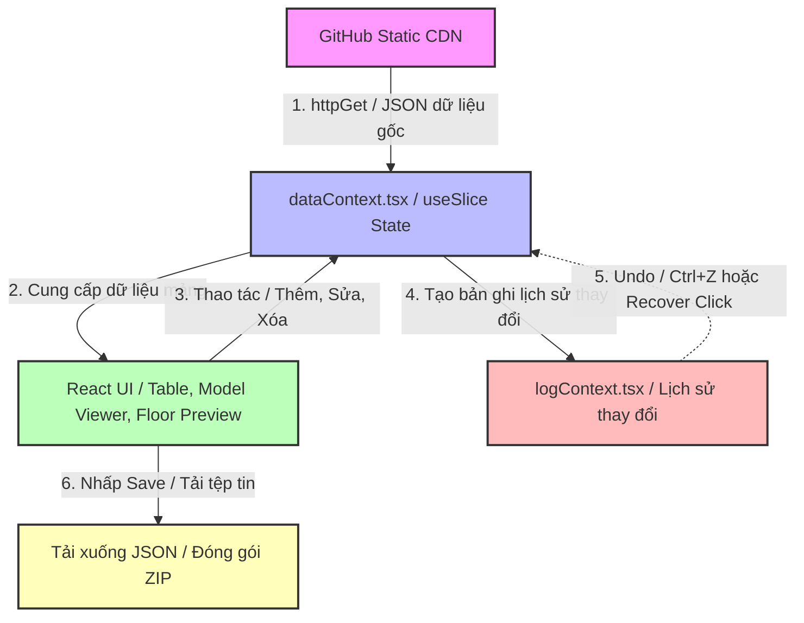

# BÁO CÁO PHÂN TÍCH KỸ THUẬT DỰ ÁN UIT IMAP MANAGER

Báo cáo này cung cấp cái nhìn toàn diện và chi tiết về cấu trúc nguồn, kiến trúc phần mềm, luồng dữ liệu, hiệu năng và bảo mật của dự án **UIT iMap Manager** nhằm giúp các kỹ sư phát triển nắm bắt hệ thống một cách nhanh chóng và chính xác nhất.

---

# 1. Tổng quan dự án

- **Mục đích của hệ thống**:
  Dự án **UIT iMap Manager** là một ứng dụng quản trị dữ liệu bản đồ tương tác (Admin Dashboard) được xây dựng dành cho hệ thống bản đồ thông minh của Trường Đại học Công nghệ Thông tin (UIT). Hệ thống này cho phép quản trị viên xem xét trực quan, thêm mới, sửa đổi, xóa bỏ và đồng bộ hóa các lớp dữ liệu bản đồ dạng 2D lẫn không gian 3D của trường học.
- **Các chức năng chính**:
  - **Quản lý thực thể bản đồ**: Xem, chỉnh sửa, xóa và thêm mới các thực thể bao gồm Hotspots (điểm neo), Rooms (phòng học/làm việc), Edges (đường nối giữa các hotspots), Tour Scenes (phân cảnh panorama 360 độ), Tourspots (điểm chuyển cảnh trong tour), và Transport (điểm trung chuyển xe buýt/tàu điện).
  - **Tương tác và ghim điểm 3D (3D Model Picking)**: Hiển thị mô hình 3D của trường học (file `/map.glb`) qua Google Model Viewer. Người dùng có thể click trực tiếp lên bề mặt mô hình để lấy tọa độ thế giới (X, Y, Z) và vector pháp tuyến (normal) nhằm tạo mới hoặc dịch chuyển vị trí của Hotspots và Tourspots trong thời gian thực.
  - **Vẽ liên kết Edges trực quan**: Cho phép người dùng chọn liên tiếp hai hotspot trên mô hình 3D để thiết lập một cạnh nối (Edge). Các cạnh này được vẽ bằng các đường dẫn SVG động đè lên khung nhìn 3D và tự động cập nhật khi xoay hoặc thu phóng camera.
  - **Lưới sơ đồ tầng (Floor Grid Preview)**: Cung cấp giao diện lưới 2D để xem trước vị trí phòng học theo từng tòa nhà và tầng. Cho phép điều chỉnh trực tiếp số cột/dòng chiếm dụng của một phòng (cơ chế Live Preview) hoặc vẽ thử vị trí phòng mới trên lưới trước khi lưu.
  - **Hệ thống Change Logs & Undo (Hoàn tác)**: Mọi thao tác thay đổi dữ liệu của người dùng đều được ghi nhận lại dưới dạng Change Logs chi tiết. Người dùng có thể hoàn tác (Undo) các hành động chỉnh sửa hoặc xóa thông qua phím tắt (`Ctrl+Z`) hoặc nút bấm Recover trên bảng log.
  - **Tải lên & Tải xuống tệp tin**: Hỗ trợ xuất dữ liệu đã sửa đổi ra các tệp tin cấu hình JSON tĩnh để triển khai. Đồng thời hỗ trợ giải nén và phân tích trực tiếp tệp tin ZIP chứa dữ liệu phân cảnh ảnh panorama cùng thư mục `/tiles` hình ảnh phân cảnh phân mảnh.
- **Kiến trúc tổng thể**:
  Ứng dụng tuân theo mô hình **Client-side Single Page Application (SPA)** hoàn toàn chạy ở phía máy khách, sử dụng thư viện **React 19** kết hợp với **TypeScript**. Không có hệ quản trị cơ sở dữ liệu (DBMS) backend hoạt động trực tiếp thông qua API ghi dữ liệu. Thay vào đó, dữ liệu gốc được nạp tĩnh từ một kho lưu trữ CDN công khai bằng giao thức HTTP GET. Mọi trạng thái cập nhật chỉ tồn tại trên bộ nhớ RAM của client; dữ liệu thay đổi được xuất ra ngoài bằng cách tải xuống (download) các file cấu hình JSON trực tiếp qua trình duyệt để cập nhật thủ công vào kho lưu trữ tĩnh (Git repo CDN).

---

# 2. Công nghệ sử dụng

Dưới đây là danh sách chi tiết các công nghệ, thư viện lõi được sử dụng và lý do tích hợp:

1. **React 19 (`react` & `react-dom` ^19.2.7)**:
   - _Lý do_: Tận dụng hiệu năng render tối ưu của React thế hệ mới, sự tinh giản của các cơ chế quản lý vòng đời component thông qua Hook, và khả năng tích hợp mượt mà với các Web Component (như Model Viewer) vốn đã được cải tiến rất mạnh trong React 19.
2. **TypeScript (~6.0.2)**:
   - _Lý do_: Đảm bảo tính an toàn về kiểu dữ liệu (type safety), giảm thiểu lỗi runtime trong quá trình phát triển thông qua kiểm tra tĩnh (static analysis), hỗ trợ tự động hoàn thành mã nguồn và tạo ra cấu trúc dữ liệu tường minh cho các mô hình phức tạp (như cấu trúc dữ liệu 3D, quy tắc kiểm tra định dạng dữ liệu).
3. **Google Model Viewer (`@google/model-viewer` ^4.3.1)**:
   - _Lý do_: Cung cấp giải pháp hiển thị mô hình 3D chuẩn glTF/GLB trực tiếp trên nền tảng Web một cách mượt mà và tối ưu hóa tài nguyên phần cứng thiết bị. Nó tích hợp sẵn các thuật toán chiếu bóng, ánh sáng, hệ thống camera xoay/thu phóng nâng cao, đồng thời mở ra API tính toán va chạm tia (Raycasting) để lấy tọa độ bề mặt 3D cực kỳ chính xác.
4. **Tailwind CSS v4 (`tailwindcss` & `@tailwindcss/vite` ^4.3.3)**:
   - _Lý do_: CSS framework thế hệ mới tích hợp trực tiếp vào compiler của Vite giúp tối ưu hóa dung lượng file CSS đầu ra, cung cấp cơ chế Utility-first CSS giúp thiết kế giao diện Admin hiện đại, nhất quán, hỗ trợ Dark Mode và Responsive một cách nhanh chóng mà không cần viết các tệp stylesheet dài dòng.
5. **TanStack Table (`@tanstack/react-table` ^8.21.3)**:
   - _Lý do_: Một thư viện quản lý logic bảng dữ liệu (headless table) cực kỳ mạnh mẽ, tách biệt hoàn toàn phần xử lý logic (như phân trang, lọc dữ liệu toàn cục, sắp xếp các cột) khỏi phần hiển thị giao diện UI. Điều này giúp tối đa hóa khả năng tùy biến giao diện hiển thị bảng.
6. **JSZip (`jszip` ^3.10.1) & FileSaver (`file-saver` ^2.0.5)**:
   - _Lý do_: `JSZip` cho phép giải nén tệp tin ZIP tải lên trực tiếp tại client, trích xuất cấu trúc thư mục `/tiles` và nội dung file `data.js` của tour 360 độ. `FileSaver` đảm nhận việc tải gói dữ liệu tiles mới cùng các file JSON đã sửa đổi xuống máy tính người dùng một cách an toàn.
7. **Lucide React (`lucide-react` ^1.25.0)**:
   - _Lý do_: Bộ icon vector chất lượng cao, gọn nhẹ và đồng bộ cho các nút chức năng, menu điều hướng và trạng thái hệ thống.
8. **Native Fetch API**:
   - _Lý do_: Không cần tích hợp Axios để tránh phình to bundle size. Yêu cầu tải dữ liệu tĩnh từ CDN được đáp ứng trọn vẹn thông qua hàm `fetch` có cấu hình chống cache (`cache: "no-store"`).

---

# 3. Cấu trúc thư mục

Cấu trúc thư mục của dự án được tổ chức theo module hóa rõ ràng:

- [`src/`](file:///d:/PROJECT/uit-imap-project/uit-imap-manager/src): Chứa toàn bộ mã nguồn ứng dụng React.
  - [`assets/`](file:///d:/PROJECT/uit-imap-project/uit-imap-manager/src/assets): Chứa các hình ảnh, biểu tượng tĩnh (`hero.png`, `react.svg`, `vite.svg`).
  - [`components/`](file:///d:/PROJECT/uit-imap-project/uit-imap-manager/src/components): Chứa các component giao diện React.
    - [`main/`](file:///d:/PROJECT/uit-imap-project/uit-imap-manager/src/components/main): Các component chính điều phối chức năng lớn của màn hình.
      - [FloorPreview.tsx](file:///d:/PROJECT/uit-imap-project/uit-imap-manager/src/components/main/FloorPreview.tsx): Quản lý giao diện và logic kéo/thả, co giãn lưới phòng học 2D.
      - [Login.tsx](file:///d:/PROJECT/uit-imap-project/uit-imap-manager/src/components/main/Login.tsx): Giao diện màn hình đăng nhập giả lập cho Admin.
      - [RightBar.tsx](file:///d:/PROJECT/uit-imap-project/uit-imap-manager/src/components/main/RightBar.tsx): Sidebar bên phải dùng để điều hướng giữa các tab dữ liệu.
      - [Shortcuts.tsx](file:///d:/PROJECT/uit-imap-project/uit-imap-manager/src/components/main/Shortcuts.tsx): Đăng ký sự kiện phím tắt toàn cục (`Ctrl+Z` cho Undo, `Ctrl+S` cho Save).
      - [Table.tsx](file:///d:/PROJECT/uit-imap-project/uit-imap-manager/src/components/main/Table.tsx): Bảng quản lý và chỉnh sửa dữ liệu đa năng dựa trên TanStack Table.
      - [Topbar.tsx](file:///d:/PROJECT/uit-imap-project/uit-imap-manager/src/components/main/Topbar.tsx): Thanh công cụ phía trên chứa các nút tương tác tệp (Import/Export JSON, ZIP) và bộ lọc tầng/tòa nhà của Floor Preview.
      - [`model/`](file:///d:/PROJECT/uit-imap-project/uit-imap-manager/src/components/main/model): Chứa module tương tác 3D.
        - [ModelViewer.tsx](file:///d:/PROJECT/uit-imap-project/uit-imap-manager/src/components/main/model/ModelViewer.tsx): Trực quan hóa và neo đậu các hotspot 3D, ghim tọa độ và vẽ cạnh liên kết.
        - [model-viewer.d.ts](file:///d:/PROJECT/uit-imap-project/uit-imap-manager/src/components/main/model/model-viewer.d.ts): Định nghĩa kiểu TypeScript mở rộng cho thẻ JSX `<model-viewer>`.
    - [`ui/`](file:///d:/PROJECT/uit-imap-project/uit-imap-manager/src/components/ui): Các component UI cơ bản, có thể tái sử dụng.
      - [Button.tsx](file:///d:/PROJECT/uit-imap-project/uit-imap-manager/src/components/ui/Button.tsx): Nút bấm tiêu chuẩn với các biến thể giao diện.
      - [Dialog.tsx](file:///d:/PROJECT/uit-imap-project/uit-imap-manager/src/components/ui/Dialog.tsx): Hộp thoại Modal hỗ trợ cả Controlled/Uncontrolled state.
      - [EditCellDialog.tsx](file:///d:/PROJECT/uit-imap-project/uit-imap-manager/src/components/ui/EditCellDialog.tsx): Dialog chỉnh sửa nhanh giá trị của một ô khi double-click.
      - [FieldEditor.tsx](file:///d:/PROJECT/uit-imap-project/uit-imap-manager/src/components/ui/FieldEditor.tsx): Trình nhập liệu thông minh (text, select, array) dựa theo kiểu trường dữ liệu.
      - [NewRowDialog.tsx](file:///d:/PROJECT/uit-imap-project/uit-imap-manager/src/components/ui/NewRowDialog.tsx): Hộp thoại tạo mới một dòng dữ liệu cho tab hiện tại.
      - [UploadJsonDialog.tsx](file:///d:/PROJECT/uit-imap-project/uit-imap-manager/src/components/ui/UploadJsonDialog.tsx): Cửa sổ nhập nội dung JSON hoặc tải file JSON để phân tích cú pháp.
      - [UploadPreviewDialog.tsx](file:///d:/PROJECT/uit-imap-project/uit-imap-manager/src/components/ui/UploadPreviewDialog.tsx): Bảng xem trước dữ liệu tải lên, hỗ trợ kiểm tra ghi đè/thêm mới.
      - [UploadZipDialog.tsx](file:///d:/PROJECT/uit-imap-project/uit-imap-manager/src/components/ui/UploadZipDialog.tsx): Phân tích file nén ZIP và đóng gói thư mục ảnh phân cảnh `/tiles`.
  - [`contexts/`](file:///d:/PROJECT/uit-imap-project/uit-imap-manager/src/contexts): Hệ thống quản lý trạng thái toàn cục của ứng dụng.
    - [userContext.tsx](file:///d:/PROJECT/uit-imap-project/uit-imap-manager/src/contexts/userContext.tsx): Quản lý phiên đăng nhập và định danh của quản trị viên.
    - [tabContext.tsx](file:///d:/PROJECT/uit-imap-project/uit-imap-manager/src/contexts/tabContext.tsx): Lưu trữ ID của tab hiện tại đang được hiển thị.
    - [logContext.tsx](file:///d:/PROJECT/uit-imap-project/uit-imap-manager/src/contexts/logContext.tsx): Thu thập lịch sử thay đổi để phục vụ chức năng phục hồi trạng thái (Undo).
    - [dataContext.tsx](file:///d:/PROJECT/uit-imap-project/uit-imap-manager/src/contexts/dataContext.tsx): Đóng vai trò là nguồn dữ liệu trung tâm (data engine) quản lý 6 slices dữ liệu bản đồ.
    - [modelContext.tsx](file:///d:/PROJECT/uit-imap-project/uit-imap-manager/src/contexts/modelContext.tsx): Trạng thái tương tác với 3D Model Viewer (các chế độ ghim điểm, vật thể đang kéo thả).
    - [floorContext.tsx](file:///d:/PROJECT/uit-imap-project/uit-imap-manager/src/contexts/floorContext.tsx): Lưu trạng thái lọc tầng/tòa nhà và tọa độ lưới phòng đang thao tác ở Floor Preview.
  - [`lib/`](file:///d:/PROJECT/uit-imap-project/uit-imap-manager/src/lib): Chứa các module tiện ích và thư viện dùng chung.
    - [httpClient.ts](file:///d:/PROJECT/uit-imap-project/uit-imap-manager/src/lib/httpClient.ts): Địa chỉ BASE_URL của CDN và các endpoints, hàm gọi HTTP GET.
    - [types.ts](file:///d:/PROJECT/uit-imap-project/uit-imap-manager/src/lib/types.ts): Khai báo toàn bộ các interface và kiểu dữ liệu nghiệp vụ của dự án.
    - [`utils/`](file:///d:/PROJECT/uit-imap-project/uit-imap-manager/src/lib/utils): Các helper functions phụ trợ.
      - [jsons.ts](file:///d:/PROJECT/uit-imap-project/uit-imap-manager/src/lib/utils/jsons.ts): Xử lý chuyển đổi, tải xuống JSON.
      - [prototypes.ts](file:///d:/PROJECT/uit-imap-project/uit-imap-manager/src/lib/utils/prototypes.ts): Các hàm sinh quy tắc (TableRule) mặc định cho các loại cột.
      - [validator.ts](file:///d:/PROJECT/uit-imap-project/uit-imap-manager/src/lib/utils/validator.ts): Logic kiểm tra tính hợp lệ của dữ liệu đầu vào.
- [`public/`](file:///d:/PROJECT/uit-imap-project/uit-imap-manager/public): Chứa các tài nguyên tĩnh được phân phối trực tiếp như tệp tin 3D `/map.glb`.
- [index.html](file:///d:/PROJECT/uit-imap-project/uit-imap-manager/index.html): File HTML khung của ứng dụng.
- [vite.config.ts](file:///d:/PROJECT/uit-imap-project/uit-imap-manager/vite.config.ts): Tệp tin cấu hình đóng gói Vite.
- [tsconfig.json](file:///d:/PROJECT/uit-imap-project/uit-imap-manager/tsconfig.json): Cấu hình cài đặt trình biên dịch TypeScript.

---

# 4. Luồng hoạt động của ứng dụng

Hệ thống vận hành thông qua các luồng tuần tự sau:

1. **Luồng khởi chạy ứng dụng (Application Startup)**:
   - Trình duyệt tải tệp tin [`index.html`](file:///d:/PROJECT/uit-imap-project/uit-imap-manager/index.html) và nạp tệp [`src/main.tsx`](file:///d:/PROJECT/uit-imap-project/uit-imap-manager/src/main.tsx).
   - `main.tsx` gọi `createRoot` gắn vào phần tử `#root` trên DOM, render component `<App />` bọc trong chế độ kiểm lỗi nghiêm ngặt `<StrictMode>`.
   - `<App />` render `<UserProvider>` ở mức cao nhất để quản lý phiên làm việc, tiếp theo render component cổng vào `<Gate />`.
   - `<Gate />` khởi tạo và bọc lồng nhau các Context Providers theo thứ tự phân cấp phụ thuộc: `<LogProvider>` $\rightarrow$ `<DataProvider>` $\rightarrow$ `<TabProvider>` $\rightarrow$ `<ModelProvider>` $\rightarrow$ `<FloorProvider>` $\rightarrow$ `<Workspace />`.

2. **Luồng hiển thị giao diện (Rendering Flow)**:
   - Component [`Workspace`](file:///d:/PROJECT/uit-imap-project/uit-imap-manager/src/App.tsx#L15) được kích hoạt. Nó dựng cấu trúc layout của màn hình: Sidebar [`RightBar`](file:///d:/PROJECT/uit-imap-project/uit-imap-manager/src/components/main/RightBar.tsx) ở biên phải, thanh điều hướng [`Topbar`](file:///d:/PROJECT/uit-imap-project/uit-imap-manager/src/components/main/Topbar.tsx) ở trên cùng, component bắt phím tắt [`Shortcuts`](file:///d:/PROJECT/uit-imap-project/uit-imap-manager/src/components/main/Shortcuts.tsx) chạy ngầm, và vùng hiển thị trung tâm.
   - Vùng trung tâm đọc giá trị `tab` từ hook `useTab()`:
     - Nếu `tab === "model"`, hiển thị component 3D [`ModelViewer`](file:///d:/PROJECT/uit-imap-project/uit-imap-manager/src/components/main/model/ModelViewer.tsx).
     - Nếu `tab === "floorPreview"`, hiển thị lưới căn phòng [`FloorPreview`](file:///d:/PROJECT/uit-imap-project/uit-imap-manager/src/components/main/FloorPreview.tsx).
     - Đối với các giá trị khác (các tab quản lý dữ liệu như `hotspots`, `rooms`, `edges`...), hiển thị component bảng quản lý [`Table`](file:///d:/PROJECT/uit-imap-project/uit-imap-manager/src/components/main/Table.tsx).

3. **Luồng định tuyến (Routing Flow)**:
   - Ứng dụng không sử dụng thư viện React Router. Việc định tuyến được thực hiện hoàn toàn dưới dạng **State-based Routing**.
   - Khi người dùng click chọn một mục trên Sidebar [`RightBar`](file:///d:/PROJECT/uit-imap-project/uit-imap-manager/src/components/main/RightBar.tsx), hàm `setTab(id)` trong [`tabContext.tsx`](file:///d:/PROJECT/uit-imap-project/uit-imap-manager/src/contexts/tabContext.tsx) được gọi để cập nhật state `tab`, kích hoạt quá trình chuyển đổi component hiển thị tức thời.

4. **Luồng tải dữ liệu (Data & API Flow)**:
   - Khi component [`DataProvider`](file:///d:/PROJECT/uit-imap-project/uit-imap-manager/src/contexts/dataContext.tsx#L232) được mount, một hiệu ứng `useEffect` chạy duy nhất một lần để khởi chạy các hàm `fetch()` bất đồng bộ của 6 phân vùng dữ liệu (slices).
   - Các hàm này gửi các yêu cầu HTTP GET bằng Fetch API qua helper `httpGet` tới các file JSON tĩnh trên GitHub CDN thông qua [`httpClient.ts`](file:///d:/PROJECT/uit-imap-project/uit-imap-manager/src/lib/httpClient.ts).
   - Khi nhận được kết quả JSON thành công, dữ liệu được đưa vào các React state tương ứng của từng slice (`hotspots`, `rooms`, `edges`, `tourScenes`, `tourspots`, `transport`).

5. **Luồng thay đổi trạng thái và sự kiện (State & Event Flow)**:
   - Khi người dùng thực hiện một hành động sửa đổi dữ liệu (ví dụ: kéo thả hotspot trên mô hình 3D, cập nhật giá trị ô trên bảng, thêm dòng dữ liệu mới, hoặc xóa một dòng):
     - Hàm tương ứng của slice (`addRow`, `removeRow`, `editRow`, `editRowFields`) trong [`dataContext.tsx`](file:///d:/PROJECT/uit-imap-project/uit-imap-manager/src/contexts/dataContext.tsx) được kích hoạt.
     - Đồng thời, hàm `updateLog` trong [`logContext.tsx`](file:///d:/PROJECT/uit-imap-project/uit-imap-manager/src/contexts/logContext.tsx) được gọi để tạo và ghi nhận một đối tượng log sửa đổi mới có trạng thái `isSaved: false` cùng giá trị cũ (`oldValue`) và giá trị mới (`newValue`).
     - State dữ liệu cục bộ được cập nhật làm kích hoạt chu kỳ re-render của React giúp hiển thị dữ liệu mới nhất lên UI.
     - Nếu người dùng nhấn tổ hợp phím `Ctrl + Z` hoặc click nút Recover trên Change Logs: Hàm `recoverTo(id)` sẽ tìm kiếm đối tượng log tương ứng, sau đó chạy hàm khôi phục ngược (recovery handler) đã được đăng ký từ [`dataContext.tsx`](file:///d:/PROJECT/uit-imap-project/uit-imap-manager/src/contexts/dataContext.tsx#L255) để hoàn tác lại trạng thái cũ của dòng dữ liệu đó.

---

# 5. Phân tích Google Model Viewer

Thư viện Google Model Viewer đóng vai trò trung tâm trong trải nghiệm tương tác bản đồ 3D của dự án. Module này được cài đặt trong tệp [`ModelViewer.tsx`](file:///d:/PROJECT/uit-imap-project/uit-imap-manager/src/components/main/model/ModelViewer.tsx).

- **Khởi tạo và cấu hình thẻ**:
  Thẻ `<model-viewer>` được cấu hình với các thuộc tính điều khiển trực tiếp:
  ```tsx
  <model-viewer
    ref={mvRef}
    src="/map.glb"
    camera-controls
    tone-mapping="neutral"
    shadow-intensity="0"
    exposure="1"
    min-camera-orbit="auto 0deg 7m"
    max-camera-orbit="auto 88deg auto"
    camera-orbit={INITIAL_ORBIT}
    field-of-view={INITIAL_FOV}
    interaction-prompt="none"
    style={{ ... }}
  >
  ```
  Thẻ này nạp trực tiếp mô hình trường học `/map.glb` từ thư mục `public/`.
- **Hệ thống Hotspot & Tourspot**:
  Các điểm neo 3D được hiển thị bằng cách ánh xạ danh sách dữ liệu từ context thành các thẻ `<button>` con đặt lồng bên trong thẻ `<model-viewer>`. Mỗi nút bắt buộc phải được đặt thuộc tính `slot` có cấu trúc định dạng riêng (ví dụ: `slot="hotspot-{h.id}"` hoặc `slot="hotspot-tourspot-{t.id}"`).
  Model Viewer sẽ tự động neo nó vào bề mặt 3D theo tọa độ được thiết lập trong thuộc tính `data-position` (định dạng: `Xm Ym Zm`) và hướng vector bề mặt `data-normal` (định dạng: `NXm NYm NZm`) của thẻ button đó.
- **Annotations (Nhãn chú thích)**:
  Bên trong mỗi thẻ `<button>` của hotspot, một thẻ `<span>` được hiển thị tuyệt đối (`absolute left-1/2 top-full mt-1 -translate-x-1/2`) hiển thị văn bản mô tả hoặc mã nhận diện ID của điểm neo đó.
- **Điều khiển góc nhìn camera**:
  Component [`ModelViewer`](file:///d:/PROJECT/uit-imap-project/uit-imap-manager/src/components/main/model/ModelViewer.tsx) xuất ra một handle tham chiếu thông qua `useImperativeHandle` cho phép Topbar hoặc các component bên ngoài gọi phương thức `zoomTo(hotspot)`.
  Phương thức này thiết lập trực tiếp thuộc tính camera của đối tượng DOM:
  ```typescript
  mv.cameraTarget = `${x}m ${y}m ${z}m`; // Đưa tâm camera vào điểm neo
  mv.cameraOrbit = `-131deg 68.84deg 8m`; // Thu hẹp bán kính quỹ đạo camera về 8m để phóng to
  mv.fieldOfView = "8deg";
  ```
- **Chế độ Ghim điểm (Picking)**:
  Khi người dùng kích hoạt `pickMode === "hotspot"` hoặc `"tourspot"`:
  - Một sự kiện `mousemove` được đăng ký trên Model Viewer. Khi người dùng di chuyển chuột, hàm `handleMouseMove` tính toán vị trí chuột so với khung chữ nhật bao quanh component (`getBoundingClientRect()`) và gọi API của Model Viewer:
    ```typescript
    const hit = mv.positionAndNormalFromPoint(pixelX, pixelY);
    ```
    Hàm này bắn một tia va chạm từ điểm nhấp chuột 2D vào bề mặt lưới đa giác 3D của mô hình để tìm tọa độ giao cắt 3D `{ position: Vec3, normal: Vec3 }`.
  - Tọa độ giao cắt tạm thời này liên tục được lưu vào state `tempPosNormal` làm cập nhật vị trí của một hotspot ảo dạng nét đứt có tên `hotspot-placeholder` bám theo trỏ chuột của người dùng.
  - Khi click chuột trái, hàm `handleModelClick` thu thập tọa độ chốt từ `positionAndNormalFromPoint` và gọi hàm callback `submitHotspotPick` hoặc `submitTourspotPick` để mở dialog điền thông tin và tạo mới bản ghi.
- **Hệ thống liên kết Edges (Cạnh nối)**:
  Vì Model Viewer không hỗ trợ vẽ trực tiếp các đường nối phức tạp giữa các hotspot trong không gian 3D, dự án sử dụng giải pháp kết hợp **2D SVG Overlay**:
  - Một thẻ `<svg>` tuyệt đối được đặt đè khít lên trên thẻ `<model-viewer>`.
  - Khi camera di chuyển, sự kiện `"camera-change"` được kích hoạt liên tục và gọi hàm `updateEdgeLines`.
  - Trong hàm này, ứng dụng duyệt qua các cạnh nối `edges` và gọi API của Model Viewer để chuyển đổi tọa độ 3D của hai điểm đầu cuối sang tọa độ pixel màn hình 2D:
    ```typescript
    const from = mv.queryHotspot(`hotspot-${first}`); // Trả về { canvasPosition: { x, y } }
    const to = mv.queryHotspot(`hotspot-${second}`);
    ```
  - Từ tọa độ `canvasPosition` thu được, ứng dụng vẽ các đường dẫn `<line x1={from.canvasPosition.x} y1={from.canvasPosition.y} ... />` trên lớp SVG.

---

# 6. Kiến trúc React

Dự án áp dụng các nguyên tắc thiết kế React hiện đại để đảm bảo khả năng mở rộng:

- **Cây phân cấp Component (Component Hierarchy)**:
  Ứng dụng có cấu trúc cây component phẳng và gọn gàng, chia tách rõ rệt khu vực Layout và các cửa sổ hội thoại (Dialogs):
  ```
  App
  └── UserProvider (Cung cấp phiên làm việc)
      └── Gate (Bọc các Provider dịch vụ và dữ liệu bản đồ)
          ├── LogProvider (Quản lý logs sửa đổi)
          ├── DataProvider (Quản lý và đồng bộ hóa các lát cắt dữ liệu)
          ├── TabProvider (Quản lý tab hiển thị hiện tại)
          ├── ModelProvider (Quản lý trạng thái tương tác 3D)
          ├── FloorProvider (Quản lý trạng thái sơ đồ tầng 2D)
          └── Workspace (Layout chính chứa các phần tử con)
              ├── Topbar (Thanh công cụ, chứa NewRowDialog, UploadJsonDialog, UploadZipDialog)
              ├── RightBar (Sidebar điều hướng tab)
              ├── Shortcuts (Bắt phím tắt chạy ngầm)
              └── [Vùng nội dung hiển thị động tùy theo Tab]
                  ├── ModelViewer (Màn hình 3D)
                  ├── FloorPreview (Màn hình lưới phòng học 2D)
                  └── Table (Màn hình bảng dữ liệu, chứa EditCellDialog)
  ```
- **Component tái sử dụng (Reusable Components)**:
  - [`Button`](file:///d:/PROJECT/uit-imap-project/uit-imap-manager/src/components/ui/Button.tsx): Đóng gói thẻ `<button>` tiêu chuẩn với kiểu dáng Tailwind, hỗ trợ truyền `icon`, lớp màu `variant` (`primary`, `secondary`, `danger`, `ghost`).
  - [`Dialog`](file:///d:/PROJECT/uit-imap-project/uit-imap-manager/src/components/ui/Dialog.tsx): Hộp thoại Modal bọc ngoài có nút đóng, tự động đóng khi nhấp vào vùng Overlay bên ngoài (backdrop mousedown) và hỗ trợ cơ chế Children as a Function `{(close) => ReactNode}` để nội dung bên trong có thể chủ động đóng modal.
  - [`FieldEditor`](file:///d:/PROJECT/uit-imap-project/uit-imap-manager/src/components/ui/FieldEditor.tsx): Thành phần phân phối trình nhập liệu đa năng. Nó đọc thuộc tính của cột (TableRule) để tự quyết định render ra thẻ `<select>` nếu trường có danh sách giá trị cố định, render ra danh sách các input mảng động nếu kiểu dữ liệu là mảng `arr` (ví dụ như danh sách link providers, tọa độ), hoặc mặc định render thẻ `<textarea>`.
- **Cơ chế Composition (Hợp phần)**:
  - Sử dụng mô hình render-prop trong `<Dialog>` để phân tách quyền quản lý trạng thái mở/đóng.
  - Các Dialog nghiệp vụ như `<NewRowDialog>`, `<EditCellDialog>`, `<UploadJsonDialog>` sử dụng component `<Dialog>` làm khung chứa để tái sử dụng toàn bộ hành vi đóng mở, layout tiêu đề và nút Close.
- **Tối ưu hóa quá trình Render (Rendering Optimization)**:
  - Sử dụng các tham chiếu `useRef` (như `dataRef` trong hook `useSlice`, `slicesRef` trong `DataProvider`) để ghi nhớ các giá trị state mới nhất. Điều này giúp các hàm callback như `addRow`, `removeRow` và hiệu ứng `useEffect` phục hồi dữ liệu có thể tham chiếu trực tiếp đến dữ liệu mới nhất mà không phải đưa state vào mảng phụ thuộc (dependency array), từ đó tránh được các vòng lặp re-render vô hạn hoặc việc khởi tạo lại các hàm liên tục.

---

# 7. Kiến trúc TypeScript

Hệ thống tận dụng TypeScript để thiết lập bộ khung kiểu dữ liệu vững chắc cho toàn bộ dự án tại tệp tin [`types.ts`](file:///d:/PROJECT/uit-imap-project/uit-imap-manager/src/lib/types.ts).

- **Shared Types (Kiểu dữ liệu dùng chung)**:
  - Định nghĩa các kiểu định danh dữ liệu `DataId` ("hotspots" | "rooms" | "edges" | "tourScenes" | "tourspots" | "transport") để đảm bảo tính nhất quán khi thao tác dữ liệu.
  - Các cấu trúc nghiệp vụ rõ ràng:
    ```typescript
    export interface Hotspot {
      id: string;
      showInDefault?: boolean;
      name?: string;
      description?: string;
      dataPosition: [number, number, number];
      dataNormal: [number, number, number];
    }
    export interface Room {
      id: number;
      name: string;
      floor?: number;
      belongsTo: string;
      category: Category;
      description?: string;
      rows?: [number, number];
      cols?: [number, number];
      hasEvent?: boolean;
    }
    ```
- **Generics**:
  - Hàm gọi API [`httpGet<T>`](file:///d:/PROJECT/uit-imap-project/uit-imap-manager/src/lib/httpClient.ts#L3) sử dụng tham số generic `T` để chuyển đổi kiểu phản hồi JSON một cách tự động và an sau.
  - Interface [`DataSlice<T>`](file:///d:/PROJECT/uit-imap-project/uit-imap-manager/src/lib/types.ts#L166) trừu tượng hóa toàn bộ thuộc tính và hành động cập nhật của một phân vùng dữ liệu bản đồ bất kỳ, giúp cho component `<Table>` có thể hiển thị và thao tác với mọi loại dữ liệu một cách nhất quán:
    ```typescript
    export interface DataSlice<T = any> {
      id: DataId;
      data: T[];
      tableRules: TableRule[];
      addRow?: (row: T) => void;
      // ...
    }
    ```
- **Type Safety Strategy (Chiến lược an toàn kiểu)**:
  - Khai báo module mở rộng cho namespace `"react"` để đăng ký thẻ tùy chỉnh `"model-viewer"` trong tệp [`model-viewer.d.ts`](file:///d:/PROJECT/uit-imap-project/uit-imap-manager/src/components/main/model/model-viewer.d.ts). Điều này giúp trình kiểm lỗi của TypeScript và React 19 hiểu rõ các thuộc tính tùy chỉnh (ví dụ: `camera-controls`, `shadow-intensity`) của Web Component này mà không ném ra cảnh báo biên dịch lỗi.

---

# 8. Luồng dữ liệu (Data Flow)

Luồng truyền tải dữ liệu giữa các lớp trong hệ thống được vận hành khép kín theo mô hình sau:



_Diễn giải chi tiết luồng vận hành:_

1. **API $\rightarrow$ State**: Lúc bắt đầu, `dataContext.tsx` nạp dữ liệu từ CDN tĩnh của GitHub. Dữ liệu nạp xong được lưu vào React State cục bộ của từng slice dữ liệu.
2. **State $\rightarrow$ UI**: Component `Table.tsx` hiển thị dữ liệu dạng dòng/cột. Component `ModelViewer.tsx` nhận các mảng tọa độ 3D để neo các button hotspot lên mô hình. Component `FloorPreview.tsx` vẽ các ô phòng học theo dạng lưới ô vuông 2D.
3. **UI $\rightarrow$ State**: Người dùng cập nhật dữ liệu (nhập form tạo mới, kéo thả điểm 3D, co giãn kích thước phòng). Lệnh cập nhật được đẩy về các hàm xử lý state trong `useSlice`.
4. **State $\rightarrow$ Log**: Mọi chỉnh sửa được ghi nhận thành một bản ghi thay đổi tạm thời trong `logContext.tsx`.
5. **Log $\rightarrow$ State (Undo)**: Sự kiện khôi phục (Ctrl+Z) đọc bản ghi thay đổi mới nhất từ log và phát lệnh phục hồi giá trị cũ ngược lại state trong `dataContext.tsx`.
6. **State $\rightarrow$ Download**: Khi người dùng nhấn Save hoặc Download JSON, hệ thống tổng hợp mảng dữ liệu trong React State và xuất ra file tải xuống máy tính của người dùng để lưu trữ lâu dài.

---

# 9. Tầng API (API Layer)

Dự án này sử dụng kiến trúc phân phối dữ liệu qua tệp tĩnh (Static Asset Delivery) thay vì hệ thống API động truyền thống:

- **Kiến trúc phân phối**:
  Mọi tệp cấu hình bản đồ được lưu trữ công khai trên GitHub repository `helitoo/uit-imap-data`. Tầng API sử dụng CDN jsDelivr làm cổng truy xuất dữ liệu tĩnh thông qua địa chỉ:
  `https://cdn.jsdelivr.net/gh/helitoo/uit-imap-data/`
- **Request Flow**:
  Hàm helper [`httpGet`](file:///d:/PROJECT/uit-imap-project/uit-imap-manager/src/lib/httpClient.ts#L3) sử dụng API Fetch mặc định của trình duyệt để gửi yêu cầu lấy dữ liệu. Cấu hình `{ cache: "no-store" }` được áp dụng nhằm ngăn trình duyệt tự động lưu trữ và trả về nội dung đệm cũ, đảm bảo dữ liệu tải về luôn là phiên bản mới nhất từ kho lưu trữ Git CDN.
- **Xử lý lỗi (Error Handling)**:
  Ứng dụng sử dụng khối lệnh `try...catch` bao quanh mã Fetch. Nếu có lỗi mạng xảy ra hoặc máy chủ CDN trả về mã trạng thái lỗi (ví dụ: `404 Not Found`), hệ thống sẽ cảnh báo qua `console.warn` và trả về giá trị fallback mặc định (thường là mảng rỗng `[]`) để ngăn chặn việc ứng dụng bị treo đột ngột.
- **Cơ chế xác thực (Authentication)**:
  Vì dữ liệu được đọc công khai trực tiếp từ CDN tĩnh, ứng dụng không triển khai cơ chế gửi khóa token xác thực (như JWT) trong header của request, và không sử dụng các interceptors.

---

# 10. Quản lý trạng thái (State Management)

Dự án quản lý trạng thái theo cơ chế phân tán thông qua React Contexts. Dưới đây là phân tích chi tiết trách nhiệm của từng Context:

1. **`userContext.tsx`**:
   - _Trách nhiệm_: Quản lý phiên đăng nhập và định danh của Quản trị viên (`user`).
   - _State lưu trữ_: `{ user: User | null, isAuthed: boolean }`.
   - _Hành động_: Cung cấp phương thức `login(name)` và `logout()`. (Hiện tại việc xác thực đang được tắt tạm thời để Admin vào trực tiếp trang quản trị).
2. **`tabContext.tsx`**:
   - _Trách nhiệm_: Lưu trữ định danh của phân vùng màn hình hiện tại đang được hiển thị.
   - _State lưu trữ_: `tab` (kiểu `TabId`).
   - _Hành động_: `setTab(tab)`. Chứa mảng hằng số cấu hình danh sách tab và biểu tượng hiển thị trên sidebar [`RightBar.tsx`](file:///d:/PROJECT/uit-imap-project/uit-imap-manager/src/components/main/RightBar.tsx).
3. **`floorContext.tsx`**:
   - _Trách nhiệm_: Quản lý trạng thái lọc và chỉnh sửa lưới ô phòng học 2D ở Floor Preview.
   - _State lưu trữ_: Tên tòa nhà (`building`), số tầng (`floor`), mã số phòng (`roomId`), phạm vi cột (`colsFrom`, `colsTo`), phạm vi dòng (`rowsFrom`, `rowsTo`).
   - _Hành động_: Cung cấp các hàm cập nhật state tương ứng để đồng bộ hóa kích thước lưới vẽ trên giao diện Floor Preview.
4. **`modelContext.tsx`**:
   - _Trách nhiệm_: Quản lý toàn bộ vòng đời tương tác 3D trên mô hình.
   - _State lưu trữ_: Chế độ ghim điểm hiện tại (`pickMode`), ID của hotspot nguồn khi nối cạnh (`edgeFirstId`), thông tin dòng dữ liệu đang chờ tạo mới (`pendingRow`), đối tượng điểm neo đang được di chuyển vị trí (`movingItem`), tọa độ di chuột tạm thời (`tempPosNormal`).
   - _Hành động_: Kích hoạt/hủy chế độ ghim điểm (`startPicking`, `cancelPicking`), hoàn tất ghim điểm neo (`submitHotspotPick`, `submitTourspotPick`), ghi nhận điểm đầu/cuối của cạnh nối (`submitEdgeHotspotClick`).
5. **`logContext.tsx`**:
   - _Trách nhiệm_: Lớp ghi nhận lịch sử thay đổi để hỗ trợ tính năng Undo.
   - _State lưu trữ_: Danh sách mảng các đối tượng logs (`log: Log[]`), trạng thái đang nạp logs từ file lưu trữ (`loading`).
   - _Hành động_: Ghi nhận log mới (`updateLog`), xóa log phục hồi (`recoverTo`), đánh dấu tất cả logs đã được lưu (`markAllSaved`), đăng ký callback khôi phục ngược dữ liệu (`registerRecoverHandler`).
6. **`dataContext.tsx`**:
   - _Trách nhiệm_: Quản lý dữ liệu lõi của ứng dụng.
   - _State lưu trữ_: Chứa 6 lát cắt trạng thái tương ứng với 6 bảng thực thể bản đồ. Mỗi lát cắt được tạo ra bởi một custom hook `useSlice<T>` chứa trạng thái nạp dữ liệu (`data: T[]`, `loading: boolean`, `error: string | null`), cấu hình quy tắc cột (`tableRules`), khóa chính định danh dòng (`rowIdKey`).
   - _Hành động_: Thực thi nạp dữ liệu từ CDN (`fetch`), thêm dòng (`addRow`), xóa dòng (`removeRow`), sửa đổi giá trị thuộc tính (`editRow`, `editRowFields`), thay đổi toàn bộ mảng dữ liệu (`setAll`).
   - _Đồng bộ Undo_: Component này đăng ký một hàm callback khôi phục ngược dữ liệu vào `LogContext`. Khi hoàn tác một log, hàm callback này sẽ tự phân tích log đó thuộc slice dữ liệu nào, sau đó gọi phương thức thêm, xóa, hoặc sửa ngược lại giá trị ban đầu để đồng bộ lại dữ liệu.

---

# 11. Hiệu năng (Performance)

Mặc dù ứng dụng xử lý các tác vụ đồ họa 3D và dữ liệu dạng bảng lớn, hiệu năng vẫn được đảm bảo nhờ các kỹ thuật tối ưu hóa sau:

- **Sử dụng Memoization để giảm tải re-render**:
  - [`Table.tsx`](file:///d:/PROJECT/uit-imap-project/uit-imap-manager/src/components/main/Table.tsx#L69) sử dụng `useMemo` bọc ngoài quá trình tạo định nghĩa cột (`columns`) của TanStack Table. Việc này giúp ngăn chặn bảng khởi tạo lại các cấu trúc cột phức tạp và làm mất trạng thái của các ô nhập liệu khi component re-render.
  - [`FloorPreview.tsx`](file:///d:/PROJECT/uit-imap-project/uit-imap-manager/src/components/main/FloorPreview.tsx) áp dụng `useMemo` để tính toán mảng phòng đã được lọc (`filteredRooms`), tìm phòng được chọn (`matchedRoom`), và tính toán kích thước chiều cao lưới tự động dựa trên số cột/dòng lớn nhất. Việc này đảm bảo các tính toán kích thước ô lưới và lặp mảng chỉ diễn ra khi dữ liệu phòng học thực sự thay đổi.
  - Các hàm sửa đổi dữ liệu cốt lõi trong `useSlice` đều được bọc trong `useCallback` để đảm bảo tính tham chiếu không đổi của hàm khi truyền xuống các component con.
- **Tối ưu hóa vẽ đồ họa đường nối (Edges Rendering)**:
  - Sự kiện di chuyển góc nhìn camera (`"camera-change"`) của `<model-viewer>` phát ra tần suất liên tục khi người dùng kéo xoay chuột.
  - Component [`ModelViewer.tsx`](file:///d:/PROJECT/uit-imap-project/uit-imap-manager/src/components/main/model/ModelViewer.tsx#L125) đã tối ưu bằng cách sử dụng `requestAnimationFrame` để hoãn việc cập nhật tọa độ đường vẽ SVG cho đến khung hình kế tiếp của trình duyệt, giúp duy trì tốc độ khung hình (FPS) mượt mà cho trải nghiệm xoay mô hình 3D.
- **Điểm nghẽn hiệu năng tiềm ẩn (Possible Bottlenecks)**:
  - Khi số lượng đường kết nối (Edges) tăng cao lên hàng trăm điểm, việc duyệt qua mảng Edges và gọi API `queryHotspot` của Model Viewer (vốn là một phương thức truy vấn sâu vào cây DOM của Web Component) để lấy tọa độ canvas X, Y liên tục trong sự kiện xoay camera sẽ trở thành điểm nghẽn hiệu năng làm giật lag giao diện.

---

# 12. Quy ước dự án (Project Conventions)

Dự án tuân thủ nghiêm ngặt các quy ước lập trình frontend hiện đại:

- **Đặt tên (Naming Conventions)**:
  - **Tên Component**: Viết theo chuẩn **PascalCase** (ví dụ: `EditCellDialog.tsx`, `UploadZipDialog.tsx`).
  - **Tên File Helper/Library**: Viết theo dạng **camelCase** (ví dụ: `httpClient.ts`, `validator.ts`, `jsons.ts`).
  - **Tên Biến/Hàm**: Viết theo dạng **camelCase** (ví dụ: `tempPosNormal`, `startPicking`, `placeMovingItem`).
  - **Tên Hằng số**: Viết **IN_HOA_TOAN_BO** phân tách bằng dấu gạch dưới (ví dụ: `BASE_URL`, `INITIAL_ORBIT`, `TABS`).
- **Tổ chức thư mục (Folder Organization)**:
  - Gom nhóm các file theo nhiệm vụ kỹ thuật và mức độ tái sử dụng (components UI dùng chung $\rightarrow$ `components/ui/`, component giao diện chính $\rightarrow$ `components/main/`, contexts $\rightarrow$ `contexts/`).
- **Imports**:
  - Nhập các thư viện bên ngoài trước (ví dụ: `react`, `lucide-react`, `jszip`).
  - Tiếp theo nhập các Contexts toàn cục.
  - Kế đến nhập các UI components hoặc Utils nội bộ.
  - Cuối cùng nhập các kiểu dữ liệu từ `types.ts` bằng cú pháp `import type`.
- **Styling**:
  - Sử dụng Tailwind CSS v4. Kiểu dáng của các thẻ HTML được viết trực tiếp vào thuộc tính `className` ngay tại chỗ (Colocation), tránh việc phân mảnh mã nguồn CSS ra các file lẻ tẻ.

---

# 13. Mẫu thiết kế (Design Patterns)

Các mẫu thiết kế phần mềm được áp dụng hiệu quả trong dự án bao gồm:

1. **Provider Pattern (Mẫu thiết kế cung cấp trạng thái)**:
   - Thể hiện rõ nét qua việc bọc ứng dụng trong chuỗi các Context Providers ở [`App.tsx`](file:///d:/PROJECT/uit-imap-project/uit-imap-manager/src/App.tsx#L36). Trạng thái được lưu trữ tập trung ở lớp Provider và phân phối xuống các component con thông qua Custom Hooks, loại bỏ hoàn toàn hiện tượng truyền props lòng vòng qua nhiều tầng (prop drilling).
2. **Custom Hook Pattern (Mẫu thiết kế Hook tùy chỉnh)**:
   - Hook `useSlice` đóng vai trò là một khuôn mẫu đóng gói toàn bộ logic quản lý trạng thái, nạp dữ liệu từ xa, ghi nhận logs và thay đổi dữ liệu của một thực thể. Việc này giúp mã nguồn của các component giao diện cực kỳ sạch sẽ và dễ đọc.
3. **Composition Pattern (Mẫu thiết kế hợp phần)**:
   - Sử dụng cơ chế render-prop/children-function trong component [`Dialog.tsx`](file:///d:/PROJECT/uit-imap-project/uit-imap-manager/src/components/ui/Dialog.tsx#L8) giúp truyền trực tiếp phương thức đóng modal (`close`) ra ngoài cho component con thực thi sau khi hoàn thành tác vụ (như khi người dùng bấm OK trên form).
4. **Observer Pattern (Mẫu thiết kế người quan sát)**:
   - Trạng thái thay đổi được Log Context ghi lại. [`dataContext.tsx`](file:///d:/PROJECT/uit-imap-project/uit-imap-manager/src/contexts/dataContext.tsx#L254) đăng ký (subscribe) một hàm xử lý khôi phục (`registerRecoverHandler`) vào Log Context. Khi người dùng kích hoạt Undo, Log Context (chủ thể quan sát) sẽ phát tín hiệu thực thi hàm khôi phục đó để thay đổi lại trạng thái dữ liệu trong Data Context (người quan sát).

---

# 14. Nợ kỹ thuật tiềm ẩn (Potential Technical Debt)

Dưới đây là các điểm hạn chế về mặt thiết kế hệ thống và đề xuất cải tiến:

1. **Trùng lặp logic xác thực dữ liệu (Duplicated Validation Logic)**:
   - _Hiện trạng_: Logic kiểm tra tính bắt buộc nhập (`isValidMandatory`), trùng lặp khóa chính ID (`isUniqueValue`), độ dài mảng cố định (`isValidFixedArray`) được gọi độc lập ở cả [`EditCellDialog.tsx`](file:///d:/PROJECT/uit-imap-project/uit-imap-manager/src/components/ui/EditCellDialog.tsx#L41) và [`NewRowDialog.tsx`](file:///d:/PROJECT/uit-imap-project/uit-imap-manager/src/components/ui/NewRowDialog.tsx#L58).
   - _Đề xuất_: Trừu tượng hóa thành một hàm kiểm tra hợp lệ tập trung `validateRow(row, tableRules)` đặt trong `validator.ts` để sử dụng chung cho cả hai dialog.
2. **Nguy cơ bảo mật khi thực thi chuỗi JS qua `new Function`**:
   - _Hiện trạng_: Trong [`UploadZipDialog.tsx`](file:///d:/PROJECT/uit-imap-project/uit-imap-manager/src/components/ui/UploadZipDialog.tsx#L16), để đọc dữ liệu biến `APP_DATA` từ file cấu hình `data.js` của zip tải lên, ứng dụng sử dụng cú pháp khởi tạo `new Function(...)` để biên dịch và chạy chuỗi JS này trong trình duyệt. Việc này tương đương với hàm `eval()` và chứa đựng nguy cơ bảo mật nghiêm trọng.
   - _Đề xuất_: Chuyển đổi file xuất bản dữ liệu `data.js` sang định dạng JSON thuần túy (`data.json`) để đọc trực tiếp bằng `JSON.parse()`, loại bỏ hoàn toàn việc thực thi mã động.
3. **Mất mát dữ liệu khi tải lại trang (Memory-only Persistence)**:
   - _Hiện trạng_: Toàn bộ dữ liệu cập nhật và lịch sử chỉnh sửa (logs) chỉ được lưu trữ trên bộ nhớ RAM của trình duyệt. Khi người dùng F5 hoặc đóng tab trình duyệt, mọi thay đổi chưa được lưu (Save/Download) sẽ bị mất hoàn toàn.
   - _Đề xuất_: Tích hợp cơ chế tự động sao lưu dữ liệu tạm thời vào `LocalStorage` hoặc `IndexedDB` của trình duyệt và tự động khôi phục lại khi ứng dụng khởi chạy lại.
4. **Liên kết cứng cấu hình bảng (Hardcoded Rules)**:
   - _Hiện trạng_: Các cấu hình luật nhập liệu bảng (`TableRules`) cho 6 bảng dữ liệu đang được khai báo cứng trực tiếp trong file [`dataContext.tsx`](file:///d:/PROJECT/uit-imap-project/uit-imap-manager/src/contexts/dataContext.tsx#L29). Điều này gây khó khăn khi muốn mở rộng hoặc thay đổi cấu trúc trường dữ liệu bản đồ.
   - _Đề xuất_: Tách biệt hoàn toàn các quy tắc bảng ra một file cấu hình JSON bên ngoài hoặc một tệp tin cấu hình riêng biệt để quản lý tập trung.

---

# 15. Đánh giá bảo mật (Security Review)

- **Lỗ hổng Cross-Site Scripting (XSS)**:
  Ứng dụng an toàn trước lỗ hổng XSS nhờ cơ chế hiển thị chuỗi văn bản mặc định của React (React tự động mã hóa thực thể HTML trước khi hiển thị). Hệ thống không sử dụng thuộc tính nguy hại `dangerouslySetInnerHTML`.
- **Rủi ro thực thi mã tùy ý (Unsafe Javascript Execution)**:
  Như đã phân tích ở phần nợ kỹ thuật, việc sử dụng `new Function()` trong [`UploadZipDialog.tsx`](file:///d:/PROJECT/uit-imap-project/uit-imap-manager/src/components/ui/UploadZipDialog.tsx#L18) để đánh giá chuỗi mã của file `data.js` là một điểm yếu bảo mật tiềm tàng. Nếu một kẻ tấn công lừa đảo người quản trị tải lên một tệp tin zip có chứa mã độc được cài cắm trong tệp `data.js`, mã độc này sẽ được thực thi trực tiếp trên trình duyệt của người quản trị với toàn bộ đặc quyền phiên làm việc hiện tại.
- **Rò rỉ thông tin mật (Secrets & Environment Variables)**:
  Hệ thống không sử dụng bất kỳ khóa bí mật (API Keys) hay thông tin nhạy cảm nào trong mã nguồn. Dữ liệu bản đồ được xác định là dữ liệu tĩnh công khai trên CDN tĩnh của GitHub nên không có nguy cơ lộ lọt dữ liệu nhạy cảm của hệ thống.

---

# 16. Đánh giá chất lượng mã nguồn (Code Quality Review)

- **Tính dễ đọc (Readability)**:
  _Đánh giá_: Rất tốt. Mã nguồn được tổ chức sạch sẽ, cấu trúc component tường minh. Các đoạn xử lý thuật toán phức tạp như cơ chế đồng bộ tọa độ của Model Viewer, tính toán lưới 2D của Floor Preview đều có chú thích rõ ràng bằng tiếng Anh.
- **Tính dễ bảo trì (Maintainability)**:
  _Đánh giá_: Tốt. Logic nghiệp vụ của các slice dữ liệu được cô lập hoàn toàn nhờ hook `useSlice`. Việc bổ sung thêm một bảng thực thể mới chỉ yêu cầu khai báo thêm một lát cắt trạng thái trong `dataContext.tsx` và định nghĩa quy tắc cột tương ứng mà không cần viết lại logic hiển thị của component `<Table>`.
- **Tính mô-đun hóa (Modularity)**:
  _Đánh giá_: Rất cao. Phân tách rõ ràng giữa lớp dữ liệu tĩnh (`httpClient.ts`), lớp định nghĩa kiểu dữ liệu (`types.ts`), lớp lưu trữ trạng thái (`contexts/`), và lớp giao diện hiển thị (`components/`).
- **Khả năng mở rộng (Scalability)**:
  _Đánh giá_: Trung bình khá. Do ràng buộc bởi kiến trúc Client-only lưu trữ dữ liệu trên bộ nhớ tạm thời RAM. Để cải thiện khả năng mở rộng, hệ thống cần được tái thiết kế tầng dữ liệu để hỗ trợ đồng bộ hóa hai chiều (Sync Engine) tới một máy chủ cơ sở dữ liệu thực thụ thông qua các API RESTful/GraphQL thay vì chỉ đọc ghi qua tệp tin JSON tải xuống thủ công.

---

# 17. Phân tích sự phụ thuộc giữa các tệp tin (File Dependency Analysis)

Các mối liên kết phụ thuộc cốt lõi trong dự án được biểu diễn như sau:

- **Tệp tin hạt nhân (Core Module)**:
  - [`types.ts`](file:///d:/PROJECT/uit-imap-project/uit-imap-manager/src/lib/types.ts): Nơi mọi component và context trong ứng dụng tham chiếu đến để lấy định nghĩa kiểu dữ liệu. Sửa đổi tệp này có thể làm thay đổi hành vi biên dịch của toàn bộ dự án.
- **Trục xương sống quản lý trạng thái (State Core)**:
  - [`dataContext.tsx`](file:///d:/PROJECT/uit-imap-project/uit-imap-manager/src/contexts/dataContext.tsx): Nhận luồng dữ liệu từ CDN, trực tiếp điều phối hành vi của các thực thể và xuất dữ liệu ra tệp. Hầu hết các component tương tác như `Table.tsx`, `ModelViewer.tsx`, `FloorPreview.tsx` đều phụ thuộc trực tiếp vào context này.
  - [`logContext.tsx`](file:///d:/PROJECT/uit-imap-project/uit-imap-manager/src/contexts/logContext.tsx): Độc lập nhưng liên kết chặt chẽ với `dataContext.tsx` để cung cấp khả năng hoàn tác.
- **Module hiển thị cốt lõi (Core Views)**:
  - [`ModelViewer.tsx`](file:///d:/PROJECT/uit-imap-project/uit-imap-manager/src/components/main/model/ModelViewer.tsx): Phụ thuộc đồng thời vào `dataContext.tsx` (lấy dữ liệu hotspot/tourspot) và `modelContext.tsx` (lấy trạng thái picking/moving).

---

# 18. Luồng thực thi chi tiết (Execution Flow)

Vòng đời từ khi người dùng mở trang web cho đến khi cập nhật giao diện hiển thị diễn ra từng bước như sau:

1. **Người dùng mở website**: Trình duyệt tải về và phân tích các file HTML, JS, CSS của ứng dụng từ máy chủ web tĩnh.
2. **React Bootstrapping (Khởi động React)**: Tệp [`main.tsx`](file:///d:/PROJECT/uit-imap-project/uit-imap-manager/src/main.tsx) chạy lệnh khởi tạo ứng dụng React trên nút DOM `#root`.
3. **App Renders (Render Ứng dụng)**: Component `<App />` render cấu trúc nhà cung cấp trạng thái.
4. **Contexts Initialize (Khởi tạo Contexts)**: Các kho chứa trạng thái Contexts được khởi tạo giá trị mặc định theo thứ tự bọc lồng nhau.
5. **API Requests (Gửi yêu cầu tải dữ liệu tĩnh)**: `useEffect` trong [`DataProvider`](file:///d:/PROJECT/uit-imap-project/uit-imap-manager/src/contexts/dataContext.tsx#L279) được kích hoạt, gửi 6 yêu cầu HTTP GET song song qua Fetch API để tải các tệp JSON cấu hình từ GitHub CDN. Khi thành công, React State của các slices được cập nhật đầy đủ dữ liệu.
6. **Model Viewer Initializes (Khởi tạo mô hình 3D)**: Người dùng chuyển sang tab "Model Preview". Component `<ModelViewer />` được mount, thẻ `<model-viewer>` tải tệp tin 3D `/map.glb` vào bộ nhớ GPU của trình duyệt.
7. **User Interactions (Người dùng tương tác)**:
   - _Tương tác 3D_: Người dùng nhấp chọn ghim một Hotspot mới. Sự kiện click chuột trên mô hình 3D kích hoạt hàm `handleModelClick`, tính toán tọa độ thế giới 3D từ điểm chạm 2D pixel, thiết lập đối tượng `pendingRow` mở hộp thoại `<NewRowDialog>`.
   - _Tương tác Bảng_: Người dùng double-click vào một ô trên bảng để mở `<EditCellDialog>`, sửa lại tên hotspot, rồi nhấn OK.
8. **Rendering Updates (Cập nhật giao diện)**:
   - Dữ liệu mới được cập nhật vào mảng `data` trong Data Context.
   - Một dòng nhật ký thay đổi được ghi nhận vào `log` trong Log Context.
   - React tự động re-render các phần giao diện bị ảnh hưởng (bảng hiển thị giá trị mới; Model Viewer tự động cập nhật vị trí nút bấm hotspot nhờ hiệu ứng đồng bộ vị trí chạy trong `useEffect`).

---

# 19. Các tệp tin quan trọng nhất (Important Files)

Dưới đây là danh sách các tệp tin quan trọng nhất cấu thành nên hệ thống kèm theo lý do chi tiết:

| Tên tệp tin          | Đường dẫn tuyệt đối                                                                                               | Lý do quan trọng                                                                                                                                                              |
| :------------------- | :---------------------------------------------------------------------------------------------------------------- | :---------------------------------------------------------------------------------------------------------------------------------------------------------------------------- |
| **types.ts**         | [types.ts](file:///d:/PROJECT/uit-imap-project/uit-imap-manager/src/lib/types.ts)                                 | Định nghĩa toàn bộ cấu trúc dữ liệu nghiệp vụ của toàn hệ thống (Hotspots, Rooms, v.v.). Đây là tài liệu tham chiếu kiểu tĩnh duy nhất của dự án.                             |
| **dataContext.tsx**  | [dataContext.tsx](file:///d:/PROJECT/uit-imap-project/uit-imap-manager/src/contexts/dataContext.tsx)              | "Trái tim" của hệ thống quản lý dữ liệu. Chứa logic khởi tạo trạng thái từ CDN, các phương thức thêm/sửa/xóa dòng dữ liệu và đăng ký cơ chế Undo.                             |
| **logContext.tsx**   | [logContext.tsx](file:///d:/PROJECT/uit-imap-project/uit-imap-manager/src/contexts/logContext.tsx)                | Điều phối lịch sử thay đổi để phục vụ khả năng hoàn tác (Undo/Recover) trạng thái dữ liệu của Admin.                                                                          |
| **modelContext.tsx** | [modelContext.tsx](file:///d:/PROJECT/uit-imap-project/uit-imap-manager/src/contexts/modelContext.tsx)            | Điều phối trạng thái tương tác không gian 3D, lưu giữ thông tin trung gian khi người dùng ghim điểm hoặc di chuyển vị trí vật thể trên mô hình 3D.                            |
| **ModelViewer.tsx**  | [ModelViewer.tsx](file:///d:/PROJECT/uit-imap-project/uit-imap-manager/src/components/main/model/ModelViewer.tsx) | Component trực quan hóa 3D phức tạp nhất. Thực hiện neo các nút HTML lên mô hình, lắng nghe sự kiện xoay camera để vẽ lại các liên kết Edges dạng SVG động đè lên khung nhìn. |
| **FloorPreview.tsx** | [FloorPreview.tsx](file:///d:/PROJECT/uit-imap-project/uit-imap-manager/src/components/main/FloorPreview.tsx)     | Điều phối giao diện xem trước 2D sơ đồ tầng dạng lưới, tính toán tự động kích thước ô lưới dựa theo số dòng/cột chiếm dụng của phòng học.                                     |
| **Table.tsx**        | [Table.tsx](file:///d:/PROJECT/uit-imap-project/uit-imap-manager/src/components/main/Table.tsx)                   | Trình hiển thị bảng dữ liệu đa năng cho tất cả các tab quản lý. Kết hợp TanStack Table để quản lý sắp xếp, lọc toàn cục và double-click để kích hoạt Dialog chỉnh sửa.        |

---

# 20. Đánh giá chung (Overall Assessment)

- **Mức độ trưởng thành của dự án (Project Maturity)**:
  _Đạt mức Khá_. Dự án đã hoàn thiện đầy đủ các chức năng tương tác cốt lõi từ bảng dữ liệu, chỉnh sửa trực tiếp, ghim tọa độ 3D nâng cao cho đến lưới sơ đồ phòng học 2D. Dự án chạy mượt mà trên nền tảng React 19 và các thư viện hiện đại mà không gặp xung đột phụ thuộc.
- **Chất lượng kiến trúc (Architecture Quality)**:
  _Đạt mức Tốt_. Việc chia tách trạng thái toàn cục thành nhiều Context chuyên biệt giúp giữ cho mã nguồn có tính mô-đun hóa cao, tránh hiện tượng re-render thừa thãi của React và giúp cho việc cô lập lỗi (error isolation) trở nên cực kỳ dễ dàng.
- **Khả năng mở rộng (Scalability)**:
  _Đạt mức Trung bình_. Kiến trúc Client-side lưu trữ dữ liệu tạm thời trên RAM là điểm hạn chế lớn nhất. Nếu khối lượng dữ liệu bản đồ tăng lên đến hàng chục nghìn thực thể, hệ thống sẽ gặp vấn đề về tải dữ liệu ban đầu và hiệu năng render của trình duyệt. Cần phát triển một Sync Engine kết nối với Database Backend chuyên biệt.
- **Khả năng bảo trì (Maintainability)**:
  _Đạt mức Tốt_. Mã nguồn phân chia thư mục khoa học, quy ước đặt tên rõ ràng, tính phụ thuộc giữa các component lỏng lẻo giúp các nhà phát triển mới dễ dàng tiếp cận và mở rộng chức năng.
- **Ước tính trình độ nhà phát triển phù hợp**:
  _Senior Frontend Developer_. Đòi hỏi nhà phát triển phải có hiểu biết vững chắc về:
  - Tối ưu hóa vòng đời render và ghi nhớ giá trị (Memoization) của React.
  - Tương tác đồ họa 3D Web (Web Component `<model-viewer>`, Raycasting va chạm tia và chiếu hình học 3D sang canvas 2D).
  - Quản lý trạng thái phân tán và cơ chế đăng ký khôi phục trạng thái (Observer/Recovery pattern).
  - Phân tích cú pháp bất đồng bộ tại client (giải nén ZIP, biên dịch chuỗi động).
