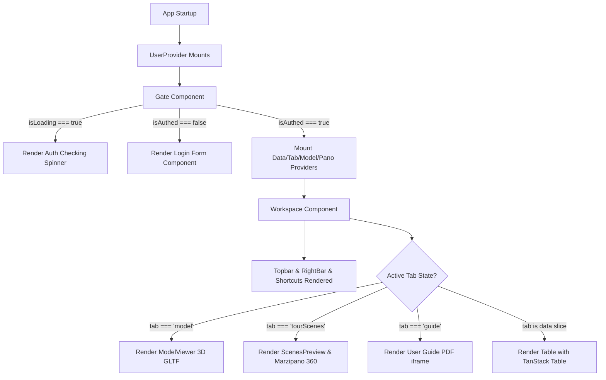
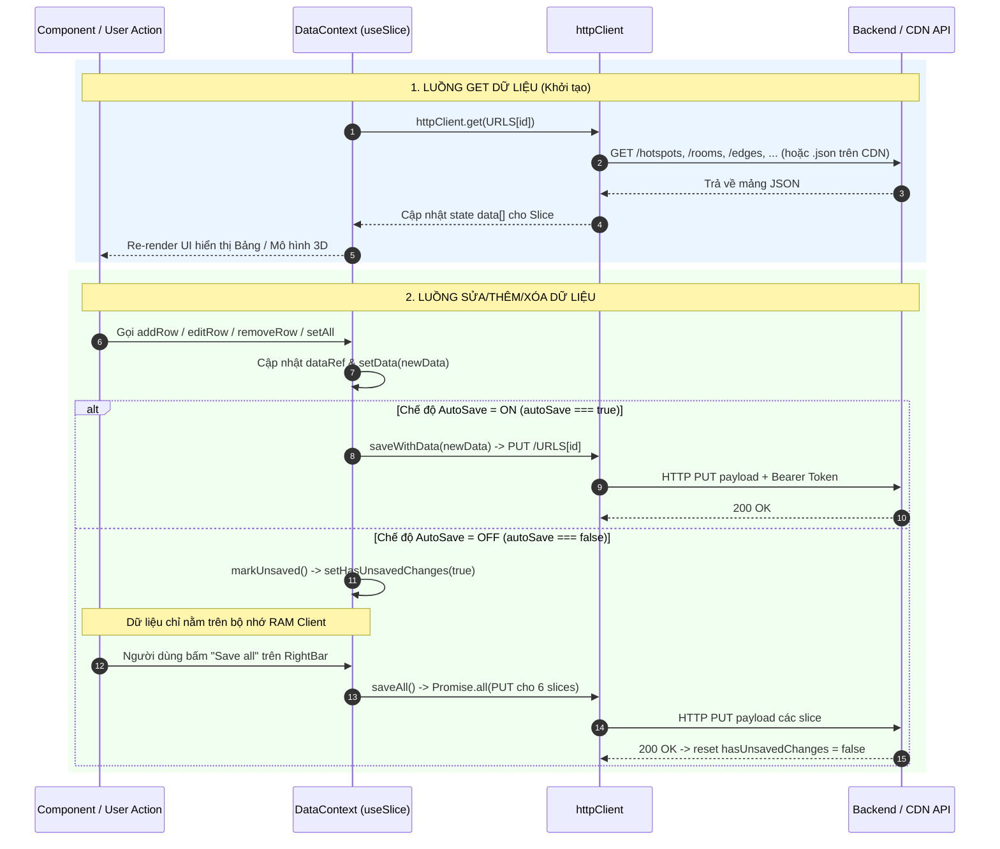

# Kiến Trúc Hệ Thống UIT iMap Manager (`manager/src`)

Tài liệu này mô tả chi tiết kiến trúc tổng quan, tổ chức các component, context, utility, kiểu dữ liệu, quy tắc render trang và luồng di chuyển dữ liệu của dự án **UIT iMap Manager** (nằm tại thư mục `manager/src`).

---

## 1. Contexts (Quản lý Trạng thái & Phạm vi Provider)

Dự án áp dụng mô hình React Context Provider bọc ngoài các thành phần của ứng dụng để quản lý trạng thái tập trung (Centralized State Management). Các Context được tổ chức phân cấp như sau:

```
App
 └── UserProvider (Authentication & Access Token)
      └── Gate
           └── DataProvider (6 Data Slices, Auto-save & CRUD)
                └── TabProvider (Navigation & View Switcher)
                     └── ModelProvider (3D Pick Modes & 3D Items Relocation)
                          └── PanoProvider (360 Panorama Tour & Link Hotspots)
                               └── Workspace
```

### Chi tiết các Context và Chức năng:

1. **`UserProvider` (`src/contexts/userContext.tsx`)**
   - **Chức năng**:
     - Quản lý trạng thái xác thực (`isAuthed`, `isLoading`), thông tin người dùng (`user`) và JWT Access Token trong bộ nhớ memory (`token`).
     - Tự động gọi API `/auth/refresh` khi ứng dụng khởi chạy (`initAuth`) để khôi phục phiên đăng nhập.
     - Cung cấp các phương thức `login(username, password)` và `logout()`.
     - Đăng ký `setUnauthCallback` với `httpClient` để tự động dọn dẹp token và chuyển trạng thái về chưa đăng nhập khi nhận lỗi 401 Unauthenticated mà không thể refresh token.

2. **`DataProvider` (`src/contexts/dataContext.tsx`)**
   - **Chức năng**:
     - Là kho lưu trữ dữ liệu trung tâm quản lý 6 lát cắt dữ liệu (Data Slices): `hotspots`, `rooms`, `edges`, `tourScenes`, `tourspots`, `transport`.
     - Cung cấp custom hook `useSlice` quản lý các thao tác CRUD (`data`, `fetch`, `save`, `addRow`, `removeRow`, `editRow`, `editRowFields`, `setAll`).
     - Quản lý chế độ lưu dữ liệu tự động (`autoSave`: boolean) và theo dõi thay đổi chưa lưu (`hasUnsavedChanges`: boolean).
     - Định nghĩa cấu hình `TableRule[]` (quy tắc hiển thị, bắt buộc, khả năng chỉnh sửa) cho từng bảng dữ liệu.
     - Lắng nghe sự kiện `beforeunload` của trình duyệt để cảnh báo khi người dùng thoát trang mà chưa lưu dữ liệu (khi `autoSave === false`).

3. **`TabProvider` (`src/contexts/tabContext.tsx`)**
   - **Chức năng**:
     - Điều hướng và theo dõi tab đang được chọn trong ứng dụng (`model`, `rooms`, `tourScenes`, `transport`, `guide`).
     - Kiểm tra nếu `autoSave === false` và có `hasUnsavedChanges`, hiển thị hộp thoại xác nhận `window.confirm` trước khi cho phép chuyển tab.

4. **`ModelProvider` (`src/contexts/modelContext.tsx`)**
   - **Chức năng**:
     - Quản lý các chế độ tương tác trên mô hình 3D (`pickMode`: `"hotspot"`, `"tourspot"`, `"edge"`, `"remove_edge"` hoặc `null`).
     - Lưu trữ hàng chờ tạo dữ liệu mới (`pendingRow`) khi người dùng click chọn vị trí trên bản đồ 3D để mở `NewRowDialog`.
     - Lưu trữ thông tin kết nối cạnh (`edgeFirstId`) khi người dùng click liên tiếp 2 điểm trên mô hình 3D.
     - Quản lý trạng thái di chuyển/tái định vị vật thể trong không gian 3D (`movingItem`, `tempPosNormal`).

5. **`PanoProvider` (`src/contexts/panoContext.tsx`)**
   - **Chức năng**:
     - Quản lý trạng thái xem và chỉnh sửa ảnh toàn cảnh 360 virtual tour (`currentSceneId`, `currentScene`, danh sách `tourScenes`).
     - Lưu trữ và điều phối đối tượng cảnh Marzipano (`registerScenes`, `getScene`, `setScene`, `nextScene`, `prevScene`).
     - Quản lý trạng thái thêm/tái định vị link hotspot nối giữa các cảnh 360 (`isAddingLinkSpot`, `pendingLinkSpot`, `relocatingIndex`, `changingSceneIndex`).

---

## 2. Main Components (Thành phần Giao diện Chính)

Các thành phần giao diện chính nằm tại thư mục `src/components/main` và `src/components/ui`:

### Layout & Core Components (`src/components/main/`)
- **`Login.tsx`**: Form đăng nhập bằng `username` và `password`, tích hợp gọi `userContext.login`.
- **`Workspace.tsx`** (trong `App.tsx`): Container bố cục chính dạng flexbox full màn hình bao gồm `Topbar`, khu vực hiển thị view chính, `RightBar` và `Shortcuts`.
- **`Topbar.tsx`**: Thanh công cụ điều hướng phía trên, thay đổi linh hoạt theo tab hiện tại:
  - Tab 3D Model: Nút thêm Hotspot, Tourspot, Edge, Remove Edge.
  - Tab Panorama Scenes: Nút thêm Linkspot, Update panorama (cắt ảnh & tải lên lại), Upload panorama (xử lý hàng loạt), Download JSON.
  - Các tab Data khác: Nút Add Row, Upload JSON/Zip, Download JSON.
  - Hiển thị Progress & Error Modal khi tiến trình cắt ảnh panorama client-side đang chạy.
- **`Table.tsx`**: Bảng dữ liệu tương tác tích hợp thư viện TanStack Table (`@tanstack/react-table`):
  - Hỗ trợ sắp xếp cột (Sorting), tìm kiếm toàn cục (Global Filter).
  - Double click vào ô để chỉnh sửa giá trị qua `EditCellDialog` (hoặc `RoomFloorDialog` với tọa độ phòng).
  - Xóa dòng dữ liệu (tự động xóa cascading các cạnh kết nối liên quan nếu xóa Hotspot).
- **`RightBar.tsx`**: Thanh điều khiển cạnh phải:
  - Nút **"Save all"** để lưu toàn bộ dữ liệu lên server.
  - Nút bật/tắt **"Auto save: ON/OFF"**.
  - Danh sách chuyển Tab điều hướng ứng dụng.
  - Thông tin người dùng hiện tại và nút **"Sign out"**.
- **`Shortcuts.tsx`**: Thành phần quản lý phím tắt tiện ích.

### Sub-view Components
1. **Model Viewer (`src/components/main/model/ModelViewer.tsx`)**:
   - Sử dụng phần tử web component `<model-viewer>` (`@google/model-viewer`) để hiển thị file 3D GLTF (`map.glb`).
   - Chuyển đổi tọa độ click chuột trên màn hình 2D thành tọa độ không gian 3D (`positionAndNormalFromPoint`).
   - Render động các nút 3D Hotspot, Tourspot và các đường liên kết Edge dạng SVG overlay.
   - Hỗ trợ menu ngữ cảnh (`HoverMenu`) khi di chuột vào từng điểm 3D (Relocate, Edit detail, Remove).
2. **Tour & Panorama Viewer (`src/components/main/tour/`)**:
   - **`ScenesPreview.tsx`**: Hiển thị danh sách các cảnh panorama dạng lưới thumbnail, cho phép đổi tên cảnh, thay đổi thứ tự (Up/Down), xóa cảnh hoặc mở xem toàn màn hình.
   - **`TourViewer.tsx`**: Trình diễn ảnh panorama 360 tích hợp thư viện **Marzipano**:
     - Chiếu ảnh equirectangular thành cubemap đa độ phân giải (multi-resolution).
     - Render linh hoạt các điểm chuyển cảnh (Link Hotspot) có thể xoay hướng mũi tên (0° - 270°), kéo thả vị trí và thay đổi cảnh đích.

### Component UI dùng chung (`src/components/ui/`)
- **`Button.tsx`**: Button tái sử dụng với các chuẩn variant (primary, secondary, ghost, danger).
- **`Dialog.tsx`**: Hộp thoại modal nền mờ.
- **`NewRowDialog.tsx` / `EditRowDialog.tsx` / `EditCellDialog.tsx`**: Modal nhập liệu/chỉnh sửa bản ghi dựa theo cấu hình `TableRule`.
- **`RoomFloorDialog.tsx`**: Ma trận trực quan để chọn vị trí hàng/cột (`rows`, `cols`) của phòng học.
- **`FieldEditor.tsx`**: Control nhập liệu tự động chọn input type (text, select dropdown cho category/values, mảng số).
- **`HoverMenu.tsx`**: Action menu mini bật lên khi hover qua các điểm hotspot trên bản đồ 3D.
- **`UploadJsonDialog.tsx` / `UploadZipDialog.tsx` / `UploadPreviewDialog.tsx`**: Chuỗi modal đọc file JSON/ZIP, xem trước dữ liệu và xác nhận chèn/ghi đè.

---

## 3. Utils (Các Thư Viện Tiện Ích)

Nằm tại thư mục `src/lib/` và `src/lib/utils/`:

1. **`httpClient.ts`**:
   - HTTP Client tùy chỉnh xây dựng trên `fetch` API.
   - Quản lý JWT Access Token trong bộ nhớ memory.
   - Tự động xử lý interceptor khi gặp lỗi **401 Unauthorized**: Đưa các request vào hàng chờ (`failedQueue`), gọi `/auth/refresh` lấy token mới và retry các request thất bại.
   - Tự động nhận diện chế độ chạy: **"server"** (backend thật) hoặc **"jsdelivr"** (CDN tĩnh, tự động thêm đuôi `.json`, `.glb`, `.jpg` vào URL).
2. **`panoProcessor.ts`**:
   - Thư viện cắt và xử lý ảnh panorama 360 hoàn toàn ở phía client (Browser-side processing) bằng HTML Canvas và JSZip.
   - Kiểm tra tỷ lệ ảnh 2:1 (Equirectangular).
   - Biến đổi ảnh Equirectangular thành 6 mặt Cubemap (`f`, `b`, `l`, `r`, `u`, `d`).
   - Phân chia thành nhiều level độ phân giải giảm dần lũy thừa 2 và cắt thành các ô nhỏ 512x512px.
   - Thực thi bất đồng bộ đa luồng song song (`mapConcurrent` với concurrency = 6).
   - Tự động tạo file `data.json` chuẩn schema Marzipano và nén thành file nén ZIP / đẩy trực tiếp lên server qua `uploadTileFolder`.
3. **`tileRegistry.ts`**:
   - Registry quản lý các Blob URL tạm thời của ô gạch panorama (`Map<string, string>`).
   - Giúp trình xem Marzipano có thể hiển thị tức thì ảnh vừa cắt ở client mà không cần chờ tải xong lên server deployment.
4. **`validator.ts`**:
   - Hàm kiểm tra tính hợp lệ dữ liệu: `isUniqueValue` (duy nhất khóa chính), `isValidRef` (khóa ngoại tồn tại), `isValidMandatory` (bắt buộc nhập), `isValidFixedArray` (đúng kích thước mảng).
5. **`jsons.ts`**:
   - Hàm chuyển đổi JSON safe (`tryJsonToObject`), format JSON và tải file JSON về máy người dùng (`downloadJson`).
6. **`prototypes.ts`**:
   - Tạo mẫu nhanh các quy tắc bảng `TableRule` (như `xyArrRule`, `xyzArrRule`, `idRule`).
7. **`apiConfig.ts`**:
   - Đọc biến môi trường `VITE_API_URL`, nếu không có sẽ dùng URL fallback tĩnh từ jsdelivr CDN.
8. **`utils.ts`**:
   - Hàm gộp class CSS `cn()` và hàm tạo link chia sẻ cảnh `getSceneShareUrl()`.
9. **`genId.ts`**:
   - Hàm sinh ID chữ cái tự động có độ dài tối thiểu 2 ký tự theo thứ tự alphabet (`aa`, `ab`, `ac`, ..., `zz`, `aaa`, ...).
   - Tự động lọc danh sách ID hiện có để tránh trùng lặp.
   - Được tích hợp làm giá trị mặc định khi khởi tạo/mở modal thêm mới cho Hotspot và Room trong `NewRowDialog`, `ModelViewer` và `DataProvider` (người dùng vẫn có thể tùy chỉnh lại ID nếu muốn).

---

## 4. Types (Định Nghĩa Kiểu Dữ Liệu)

Tập trung tại `src/lib/types.ts` và `src/lib/types/pano.ts`:

- **Domain Types**:
  - `Hotspot`: `{ id, name, description, showInDefault, dataPosition, dataNormal }`
  - `Room`: `{ id, name, floor, belongsTo, category, description, rows, cols, hasEvent }`
  - `Edge`: `{ first, second }`
  - `TourScene`: `{ id, name, levels, faceSize, initialViewParameters, linkHotspots, infoHotspots }`
  - `Tourspot`: `{ id, sceneId, dataPosition, dataNormal }`
  - `Transport`: `{ spot, name, type, providers }`
  - `Category`: Danh mục loại phòng (`classroom`, `computer_room`, `hall`, `lab`, `library`, `office`, `stairs`, `warehouse`, `wc`, `tech`).
- **Control Types**:
  - `DataId`: `"hotspots" | "rooms" | "edges" | "tourScenes" | "tourspots" | "transport"`
  - `TabId`: `DataId | "model" | "guide"`
  - `PickMode`: `"hotspot" | "tourspot" | "edge" | "remove_edge" | null`
  - `TableRule`: Quy tắc định hình thuộc tính bảng (label, type, mandatory, editable, values).
  - `DataSlice<T>`: Interface định nghĩa state & method cho từng lát cắt dữ liệu.
- **Pano Types (`types/pano.ts`)**:
  - `LinkHotspot`, `InfoHotspot`, `ViewParameters`, `TourLevel`, `MarzipanoScene`.

---

## 5. Quy Tắc Render Page (Page Rendering Rules)

Ứng dụng được tổ chức render theo quy trình kiểm soát luồng điều kiện (Conditional Guarded Rendering):



1. **Giai đoạn Xác thực (`Gate`)**:
   - Nếu `isLoading === true`: App hiển thị màn hình chờ spinner *"Checking authentication..."*.
   - Nếu `isAuthed === false`: Gate trả về component `<Login />`.
   - Nếu `isAuthed === true`: Gate bao bọc cây ứng dụng bằng 4 Providers (`DataProvider` -> `TabProvider` -> `ModelProvider` -> `PanoProvider`) và render `<Workspace />`.

2. **Giai đoạn Chuyển Tab (`Workspace`)**:
   - `Workspace` render bố cục tĩnh gồm `Topbar` ở phía trên, `RightBar` ở bên phải và `Shortcuts` ở góc.
   - Khu vực `<main>` thực hiện render linh hoạt theo giá trị state `tab` từ `useTab()`:
     - `tab === "model"`: Render `<ModelViewer />`.
     - `tab === "tourScenes"`: Render `<ScenesPreview />` (và `TourViewer` modal khi xem 360).
     - `tab === "guide"`: Render `<iframe src="/manager/guide.pdf" />`.
     - `tab` là 1 trong các DataId (`rooms`, `hotspots`, `edges`, `tourspots`, `transport`): Render `<Table />` nạp slice tương ứng từ `useData()`.

---

## 6. Luồng Di Chuyển Của Dữ Liệu (Data Flow)

Luồng dữ liệu trong ứng dụng chia làm 2 giai đoạn chính: **Lấy dữ liệu (GET)** và **Lưu dữ liệu (MUTATION & SAVE)**.



### 6.1. Cách GET (Tải) Dữ Liệu:
1. Khi `DataProvider` được mount, 6 custom hook `useSlice` đại diện cho 6 tập dữ liệu sẽ tự động thực thi hàm `fetch()`.
2. `fetch()` gọi `httpClient.get<any>(URLS[id])`:
   - Ở chế độ **server**: Gửi HTTP GET đến backend endpoint (ví dụ: `/hotspots`, `/rooms`, `/edges`, `/tourScenes`, `/tourspots`, `/transport`).
   - Ở chế độ **jsdelivr (CDN)**: `httpClient` tự động chuyển đổi route bằng cách nối đuôi `.json` (ví dụ: `/hotspots.json`).
3. Dữ liệu mảng trả về được nạp vào React State `data` và `dataRef` của từng slice, làm cho toàn bộ ứng dụng re-render với dữ liệu mới.

### 6.2. Cách SỬA & LƯU Dữ Liệu (Phân chia Autosave ON vs OFF):

Mọi thao tác thay đổi dữ liệu (`addRow`, `removeRow`, `editRow`, `editRowFields`, `setAll`) đều đi qua hàm tập trung `handleMutation(newData)` trong `useSlice`:

#### TRƯỜNG HỢP 1: Chế độ Auto Save BẬT (`autoSave === true`) - Mặc định
1. Khi người dùng thêm/sửa/xóa 1 bản ghi trên Table hoặc trên Mô hình 3D/Panorama, `handleMutation` cập nhật state cục bộ lập tức.
2. Ngay sau đó, `handleMutation` tự động kích hoạt `saveWithData(newData)` cho riêng slice đó.
3. `saveWithData` tạo HTTP request:
   - Method: `PUT`
   - URL: Endpoint tương ứng (`/hotspots`, `/rooms`, v.v.)
   - Header: `Content-Type: application/json`, `Authorization: Bearer <token>`
   - Body: JSON payload của mảng dữ liệu mới.
4. Trường hợp người dùng đang tắt Autosave và chuyển công tắc **Auto save sang ON**, `setAutoSave(true)` sẽ ngay lập tức tự động đồng bộ tất cả các thay đổi chưa lưu lên server bằng lệnh `saveAll()`.

#### TRƯỜNG HỢP 2: Chế độ Auto Save TẮT (`autoSave === false`)
1. Khi có thao tác chỉnh sửa dữ liệu, `handleMutation` cập nhật state cục bộ trên RAM và gọi `markUnsaved()`.
2. State `hasUnsavedChanges` chuyển thành `true`. Nút **"Save all"** trên `RightBar` sẵn sàng cho người dùng kích hoạt thủ công.
3. Dữ liệu thay đổi tạm thời lưu trên bộ nhớ ứng dụng và **CHƯA** được gửi lên server.
4. Để lưu dữ liệu: Người dùng nhấp vào nút **"Save all"** ở `RightBar`. Hàm `saveAll()` được gọi, sử dụng `Promise.all` để thực thi đồng thời các HTTP `PUT` request lưu toàn bộ 6 slices lên server, sau đó đặt `hasUnsavedChanges = false`.
5. **Cơ chế bảo vệ dữ liệu chưa lưu**:
   - **Chuyển Tab**: `TabProvider.setTab()` kiểm tra nếu `!autoSave && hasUnsavedChanges`, ứng dụng hiển thị hộp thoại `window.confirm("Changes you made may not be saved!")`. Nếu người dùng ấn Cancel, thao tác chuyển tab sẽ bị hủy.
   - **Tắt/Reload Trình duyệt**: `DataProvider` sử dụng `useEffect` đăng ký sự kiện `beforeunload`. Trình duyệt sẽ bật thông báo ngăn người dùng lỡ tay đóng trang làm mất dữ liệu.
